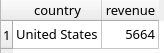
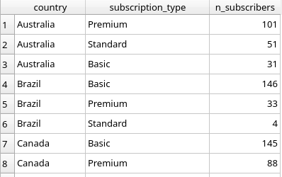
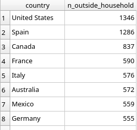
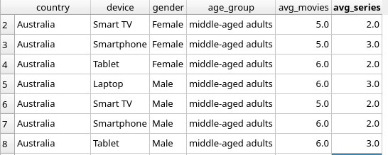

# Data Engineer Take Home Task

### How to use

Clone the repo git clone https://github.com/miguelferreira13/inbank.git

##### Dependencies
There is a `requirements.txt` file that can be used to install the dependencies for this project.
Docker is need to execute the optional step mentioned below.

##### Executing
You can use the `make run` command to run the pipeline, it is divided in 3 steps, extract, transform and load.

##### Optional
The data is then written to the `netflix.db` and can be viewed and interacted with using the SQLite Browser.

To run the SQLite Browser locally you can use `make start-sqlbrowser` and open http://localhost:3000, click `open database` and select `netflix.db`, you can now browse the data and execute queries (some examples below).


### Assignment

1.` Construct a normalized data model for the dataset provided.`

I decided to create 3 main tables to store the data: Users, Subscriptions, Activity.
We could use another table for devices and even one more for profiles, which would be a better approach if we would have multiple devices per user, or the data wouldn't be aggregated.

2.` Load the data into the data model you constructed and into DB engines like
MySQL/SQLite/Postgres or some free online one using the ELT approach (Extra points if you
use Python and SQL in combination to achieve this task). How would you make such loading
repeatable on a regular basis?`

2.1 - I choose SQLite for simplicity and easier reproducibility, I used Python and SQL as advised, and added an interface to visualize the data and reproduce the queries.

2.2 - In order to make this loading repeatable, we could have the this script fetch the data from a cloud storage and schedule it to run as often as we would like using Jenkins, Airflow or similar. We could upload the file directly to this repo, overriding the original and following the same scheduling referred above. 
    
3.` What control measures could be deployed here to ensure the correctness of data? Do
you notice something odd about the dataset provided?`

3.1 - Data validation to check for missing values, data types, and ensure data conforms to predefined rules.
Use foreign key constraints to maintain the relationships between tables.
Regular data quality checks by implementing automated scripts to periodically validate and clean the data.

3.2 - The fact that each user is only associtated with one device.
There are 6 outlier values in the age column (2, 15, 17, 26, 107, 904).
The number of users per country is the same for several countries, but that's probably because it's a fake dataset, the same for other columns.
The fact that many users start on the same dates, but there are dates when only a single user joins, can be explained by promotional campaigns.


4. `Write queries for answering the following questions:`

    #### a. The most profitable country for Netflix.
    ```
    SELECT 
        s.country,
        SUM(s.monthly_revenue) revenue
    FROM users u
    JOIN subscriptions s ON s.id = u.subscription_id
    GROUP BY s.country
    ORDER BY revenue DESC
    LIMIT 1
    ```
    In this query I am selecting the sum of the monthly revenue per country, and ordering by high to low, and then limiting for only one result, giving us the US with 5664.

    

    #### b. The most popular packages per country.
    ```
    SELECT 
        s.country,
        s.subscription_type,
        count(*) n_subscribers
    FROM users u
    JOIN subscriptions s ON s.id = u.subscription_id
    GROUP BY s.country, s.subscription_type
    ORDER BY s.country, n_subscribers DESC
    ```
    In this query I select a count of subscribers, per subscription type and country, then I am ordering by country first and then number of users.
    We have for example Austrian users that prefer Premium, Standard, Basic in that order.

    

    #### c. Which country has the potential for improving earnings if Netflix starts charging subscribers an additional fee for sharing Netflix households outside of their own?
    ```
    SELECT 
        s.country,
		SUM(a.active_profiles - a.household_profile_ind) n_outside_household
    FROM users u
    JOIN subscriptions s ON s.id = u.subscription_id
    JOIN activity a ON a.user_id = u.id
    WHERE
        a.active_profiles > a.household_profile_ind
    GROUP BY s.country
    ORDER BY n_outside_household DESC
    ```

    Here I am selecting sum of the difference between total profiles and household profiles, filtering only for when the total amount of profiles is higher than the household profiles, then grouping by country and ordering in descending order by the number of profiles outside the household.
    The US has 1346 profiles outside that are not in the same household as the user, making it the country with the most potential for improved earnings.

    

    #### d. A report showing the popularity of Movies and Series in different customer segments and the device used to consume, across the different markets the company operates in.
    ```
    SELECT 
        s.country,
		u.device,
		u.gender,
		CASE 
			WHEN u.age BETWEEN 0 AND 17 THEN 'young adults'
			WHEN u.age BETWEEN 18 AND 64 THEN 'middle-aged adults'
			WHEN u.age > 64 THEN 'old adults adults'
		END age_group,
		ROUND(AVG(a.movies_watched), 0) avg_movies,
		ROUND(AVG(a.series_watched),0) avg_series
    FROM users u
    JOIN subscriptions s ON s.id = u.subscription_id
    JOIN activity a ON a.user_id = u.id
    GROUP BY s.country, u.gender, age_group, u.device
    ```

    I choose gender, age group and country as customer segments (age groups were picked based on [this](https://www.researchgate.net/publication/228404297_Classification_of_Age_Groups_Based_on_Facial_Features#:~:text=Four%20age%20groups%2C%20including%20babies,used%20in%20the%20classification%20system.) publication), selected the average number of series and movies and the device used, and grouped by the segments and device.

    

### Comments

On production I will probably opt for using MySQL or Postgres, include a migration folder with the queries for table creation and defined keys, foreign keys, contraints, indexes, etc.
The job would also be reading the file from a cloud storage solution to make it easier for anyone to update, unit tests and integration tests would also be inlcuded and a workflow management tool integration to schedule the process.
If there was more processing to be done and transformation then probably each step should have his own file as well.